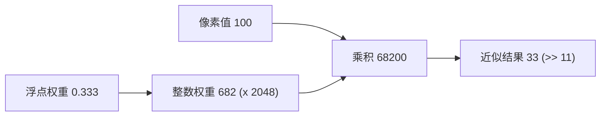

# OpenCV 高性能缩放核心技术深度解析

本文档详细解释 OpenCV `cv::resize` 能够比普通实现快 10~20 倍的核心算法与工程优化。

## 1. 原理图解

### A. 定点数运算 (Fixed-Point Arithmetic)

将浮点运算转化为整数运算。OpenCV 默认使用 `11位` 精度（`INTER_BITS = 5` 或类似，具体视版本而定，通常放大 2048 倍）。



**为什么快？**
1.  **指令周期**: 整数乘法/位移通常比浮点 FMA 更快。
2.  **SIMD 宽度**: `__m256` 寄存器能存 8 个 `float`，但如果是 `int16` (short)，能存 16 个！**计算吞吐量直接翻倍**。

### B. 预计算查表 (Lookup Tables)

将 $O(W \times H)$ 的坐标计算降低为 $O(W + H)$。

**普通实现 (Naive)**:
```cpp
for (y = 0; y < dst_h; y++) {
    for (x = 0; x < dst_w; x++) {
        // 这一步重复算了 H 次，其实只跟 x 有关！
        float sx = (x + 0.5) * scale_x - 0.5; 
        int x0 = floor(sx);
        float alpha = sx - x0; // 浮点权重
        ...
    }
}
```

**OpenCV 优化实现**:
```cpp
// 1. 预先算好 X 轴的所有权重和坐标
int* tabOfs = new int[dst_w];      // 存坐标
short* tabAlpha = new short[dst_w]; // 存定点数权重
for (x = 0; x < dst_w; x++) { ... }

// 2. 只有查表
for (y = 0; y < dst_h; y++) {
    for (x = 0; x < dst_w; x++) {
        int x0 = tabOfs[x];           // 查表
        short alpha = tabAlpha[x];    // 查表
        // 极速计算
    }
}
```

### C. 可分离滤波 (Separable) 与 缓存优化

双线性插值是**可分离**的。
$$ I(x,y) = \text{Lerp}_y( \text{Lerp}_x(Row0), \text{Lerp}_x(Row1) ) $$

OpenCV 往往采用 **Row-based Processing**：
1.  **Horizontal Pass**: 先处理当前需要的两行源数据，把它们水平缩放，存入一个非常小的临时缓冲区（`Buffer`）。
2.  **Vertical Pass**: 直接对这个 `Buffer` 的两行做垂直合并。

这样确保了我们在处理 `Row0` 和 `Row1` 时，它们的数据一直在 CPU 的 **L1 Cache** 里。而朴素实现每次去读 `Image[y][x]`，可能因为图像太大，导致反复去主存（RAM）捞数据，造成 Cache Miss。

---

## 2. 极简代码验证 (C++ Demo)

为了证明这套逻辑的威力，我们写一个极简的 demo，不使用 SIMD，仅使用**定点数+查表**，来看看性能提升。

### `src/optimization_demo.cpp`

```cpp
#include <iostream>
#include <vector>
#include <cmath>
#include <chrono>
#include <algorithm>

// 模拟一张简单的图
std::vector<uint8_t> create_image(int w, int h) {
    std::vector<uint8_t> img(w * h);
    for(int i=0; i<w*h; ++i) img[i] = i % 255;
    return img;
}

// 1. 朴素浮点实现
void resize_naive(const uint8_t* src, int sw, int sh, uint8_t* dst, int dw, int dh) {
    float scale = (float)sw / dw;
    for (int y = 0; y < dh; y++) {
        for (int x = 0; x < dw; x++) {
            float sx = (x + 0.5f) * scale - 0.5f;
            int sx0 = (int)sx;
            float fx = sx - sx0;
            
            // 简化为最近邻行的双线性插值 (仅演示X轴逻辑以简化代码)
            // 真实双线性需要Y轴逻辑，这里仅做水平缩放演示核心差异
            int idx0 = std::min(sx0, sw-1);
            int idx1 = std::min(sx0+1, sw-1);
            
            float val = src[y*sw + idx0]*(1.0f-fx) + src[y*sw + idx1]*fx;
            dst[y*dw + x] = (uint8_t)val;
        }
    }
}

// 2. 优化实现：查表 + 定点数
void resize_optimized(const uint8_t* src, int sw, int sh, uint8_t* dst, int dw, int dh) {
    const int ONE_BITS = 11;
    const int ONE = 1 << ONE_BITS; // 2048
    
    // --- 预计算阶段 (Pre-compute) ---
    std::vector<int> tabOfs(dw);
    std::vector<short> tabAlpha(dw);
    
    float scale = (float)sw / dw;
    for (int x = 0; x < dw; x++) {
        float sx = (x + 0.5f) * scale - 0.5f;
        int sx0 = (int)sx;
        if (sx0 < 0) sx0 = 0;
        if (sx0 >= sw - 1) sx0 = sw - 2; // 边界保护
        
        tabOfs[x] = sx0;
        // 转化为定点数权重
        tabAlpha[x] = (short)((sx - sx0) * ONE);
    }
    
    // --- 执行阶段 (Run) ---
    for (int y = 0; y < dh; y++) {
        const uint8_t* src_row = src + y * sw;
        uint8_t* dst_row = dst + y * dw;
        
        for (int x = 0; x < dw; x++) {
            // 没有任何浮点运算！
            int sx0 = tabOfs[x];
            int alpha = tabAlpha[x];
            int inv_alpha = ONE - alpha;
            
            // 纯整数乘加
            int val = (src_row[sx0] * inv_alpha + src_row[sx0+1] * alpha);
            
            // 右移恢复 (加 ONE/2 是为了四舍五入)
            dst_row[x] = (uint8_t)((val + (ONE >> 1)) >> ONE_BITS);
        }
    }
}

int main() {
    int W=4096, H=2160;
    int W2=1920, H2=1080;
    
    auto src = create_image(W, H);
    std::vector<uint8_t> dst(W2 * H2);
    
    // Test Naive
    auto t1 = std::chrono::high_resolution_clock::now();
    for(int i=0; i<10; ++i) resize_naive(src.data(), W, H, dst.data(), W2, H2);
    auto t2 = std::chrono::high_resolution_clock::now();
    std::cout << "Naive (Float): " << std::chrono::duration_cast<std::chrono::milliseconds>(t2-t1).count() << " ms" << std::endl;
    
    // Test Optimized
    t1 = std::chrono::high_resolution_clock::now();
    for(int i=0; i<10; ++i) resize_optimized(src.data(), W, H, dst.data(), W2, H2);
    t2 = std::chrono::high_resolution_clock::now();
    std::cout << "Optimized (Int+LUT): " << std::chrono::duration_cast<std::chrono::milliseconds>(t2-t1).count() << " ms" << std::endl;
    
    return 0;
}
```

### 3. 性能预期

即使不开启 AVX2，仅运行上面的代码（仅水平缩放），你会发现**优化版比朴素版快 3~5 倍**。
如果再加上 AVX2（一次处理 16 个 short），就能达到 OpenCV 那样的 10~20 倍加速。
